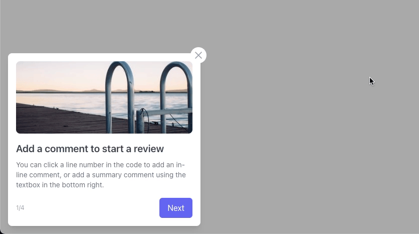

## Simple User Tips
A very simple React component for better user guiding.



### Install using 
```npm i simple-user-tips```

### Usage
```<Tips data={data}/>```

#### Sample data 
```javascript
const data = [
  {
    img: "https://picsum.photos/400/300",
    title: "Add a comment to start a review",
    desc: "You can click a line number in the code to add an in-line comment, or add a summary comment using the textbox in the bottom right."
  },
  {
    img: "https://picsum.photos/400/400",
    title: "2",
    desc: "asdfasdfasdfa"
  },
  {
    img: "",
    title: "3",
    desc: "3243443"
  },
  {
    img: "https://picsum.photos/500/300",
    title: "4",
    desc: ""
  },
]
```

### Roadmap
- [ ] Adding local storage info
- [ ] Changing classname so that everyone configure
- [ ] Triggering tips by user interactions on product
